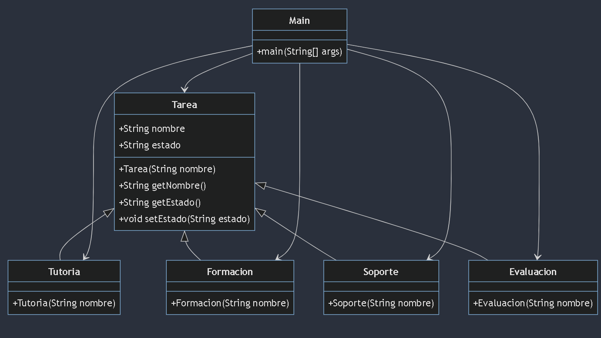
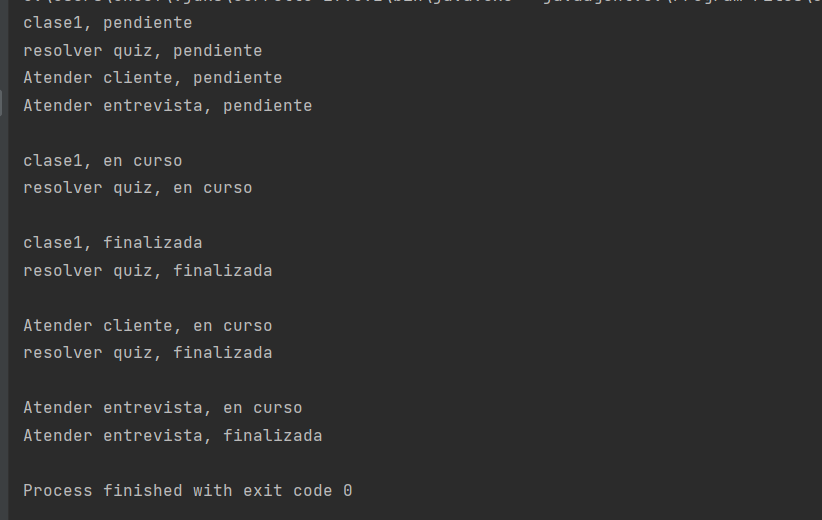

## Mi Lista de Tareas
Este programa es una herramienta simple para gestionar diferentes tipos de tareas que un programador con experiencia puede enfrentar en su carrera. Las tareas se atienden en el orden en que llegan y se pueden marcar como pendientes, en curso o finalizadas.

## requisitos: 

tener java 19 para poder ejecutar SDK (corretto 19)

## Clases
El programa consta de las siguientes clases:

**_Tarea:_** Representa una tarea genérica con un nombre y un estado (pendiente, en curso o finalizada). Otras clases de tareas heredan de esta clase base.

**_Tutoria:_** Representa una tarea de tutoría.

_**Formacion:**_ Representa una tarea de formación o resolución de quiz.

**_Soporte:_** Representa una tarea de soporte o atención a un cliente.

**_Evaluacion:_** Representa una tarea de evaluación o entrevista.

**_Main:_** Clase principal que muestra ejemplos de uso del programa.

## Uso
El programa permite gestionar tareas de la siguiente manera:

Se crean instancias de las clases Tutoria, Formacion, Soporte y Evaluacion, representando diferentes tipos de tareas.

Las tareas se muestran inicialmente como "pendientes".

Se cambia el estado de algunas tareas a "en curso" y luego a "finalizadas".

Se muestra la salida correspondiente, mostrando el nombre de la tarea y su estado actual.

## Instalación
Clona este repositorio en tu máquina local.

Asegúrate de tener Java instalado en tu sistema.

Compila el programa ejecutando el siguiente comando en la terminal:

        javac Main.java
Ejecuta el programa con el siguiente comando:

        java Main
## diagrama

codigo mermaid::
    
    classDiagram
    class Tarea {
    +String nombre
    +String estado
    +Tarea(String nombre)
    +String getNombre()
    +String getEstado()
    +void setEstado(String estado)
    }
    
        class Tutoria {
            +Tutoria(String nombre)
        }
    
        class Formacion {
            +Formacion(String nombre)
        }
    
        class Soporte {
            +Soporte(String nombre)
        }
    
        class Evaluacion {
            +Evaluacion(String nombre)
        }
    
        class Main {
            +main(String[] args)
        }
    
        Tarea <|-- Tutoria
        Tarea <|-- Formacion
        Tarea <|-- Soporte
        Tarea <|-- Evaluacion
        Main --> Tarea
        Main --> Tutoria
        Main --> Formacion
        Main --> Soporte
        Main --> Evaluacion

## EJEMPLO DE EJECUCION:

AUTHOR: [CARLOS G]
GITHUB: @CARLOSGRCIAGRCIA